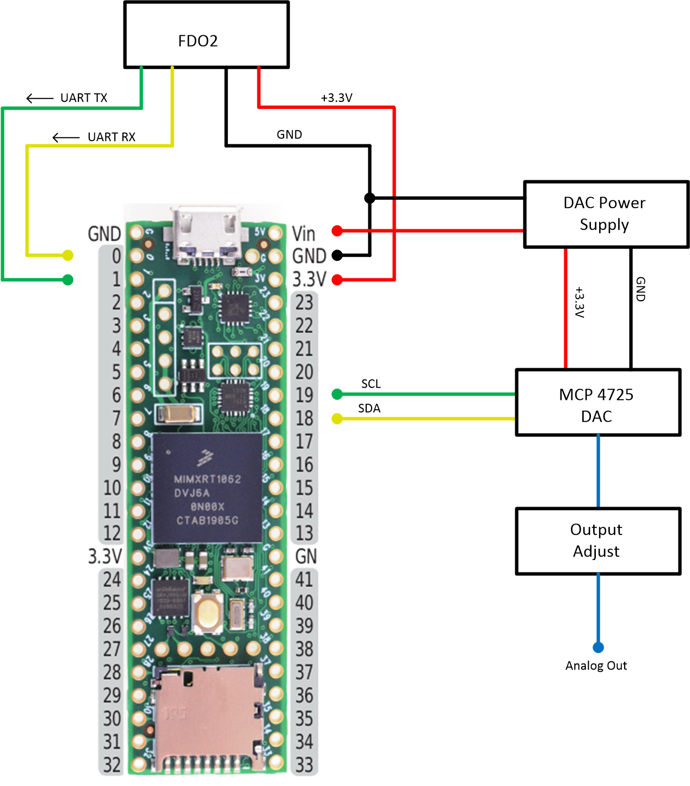

# O2SensorController

This project reads PPO2 values from an FDO2 sensor, and outputs an analog voltage proportional to the PPO2 level via an I2C MCP4725 DAC. This firmware is implemented on a Teensy 4.1. 

## Hardware Config

Connect hardware as shown:



## Development Environment
The following software is required: 

* Arduino 1.8.19 - https://www.arduino.cc/en/software
* Teesnyduino 1.57 - https://www.pjrc.com/teensy/td_download.html

For a VSCode environment with git, install the following: 

* VSCode - https://code.visualstudio.com/
* TyTools - https://github.com/Koromix/tytools
* Visual Teensy (For adding libraries or creating a new project) - https://github.com/luni64/VisualTeensy
* git - https://git-scm.com/download

Be sure to install both Arduino and TyTools to "Program Files" rather than "Program Files (x86), or you'll have to modify the paths in the makefile. 

For VSCode, you'll also need GNU Make. To get that on windows, do the following:

Install Chocolatey: https://chocolatey.org/install
After installing, open a new PowerShell session as adminstrator, then execute the following two commands:

```
$ choco
$ choco install make
```

Install the following VSCode Extensions: 

* C/C++
* C/C++ Extension Pack
* C/C++ Themes
* Better C++ Syntax

## Pulling project from GitHub

Create a folder where you want your project and open it in VSCode. 

At the terminal in the bottom of the screen in VSCode, you can create a Git bash terminal in the project directory by clicking the pulldown next to the plus icon. 

Use the following commands to set your username and email, if you just set up git for the first time. You only have to do this once. 

```
$ git config --global user.name "John Doe"
$ git config --global user.email johndoe@example.com
```

To clone this repository use the following command: 

```
git clone https://github.com/ObiKwiet/O2SensorController
```
To update your project with the latest changes from GitHub use

```
git pull origin master
```

## Compiling and Uploading.

To compile the code in VSCode use Terminal->Run Build Task... and type `Build` in the command bar.

To upload the firmware to the Teensy in VSCode use Terminal->Run Build Task... and type `Upload (TyCommander)` in the command bar.


